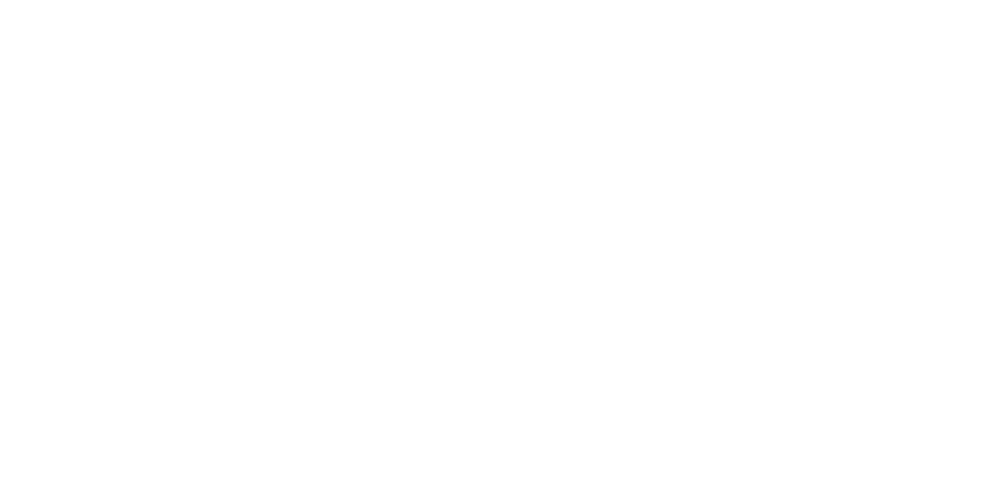

    <picture>
        <!-- for future proofing -->
        <source media="(prefers-color-scheme: dark)" srcset="assets/img/banner/png/github-banner.png">
        <source media="(prefers-color-scheme: light)" srcset="assets/img/banner/png/github-banner.png">
        
    </picture>

[Why Steel?](#why-steel) | [Installation](#installation) | [Getting Started](#getting-started) | [License](#license)

    
    
    

This repository contains the main source code for Steel, including the compiler, standard library, and any related tools.

Steel is a performant, compiled programming language that aims to wipe out all bugs at compile time, leaving your program error free and blazing fast.

<!-- we have to use markdown for blockquotes as github doesn't support them well in html -->
> [!WARNING]
> Steel is currently in pre-release. All features may not fully functional and you may find plenty of bugs, this version is **not** meant to be used for any real projects, everything is subject to change at any time.

<h2>Why Steel?</h2>
<ul>
    <li><strong>Efficiency:</strong> A clean, expressive syntax inspired by languages such as C, Rust, and Swift, designed to be intuitive and easy to write.</li>
    <li><strong>Reliability:</strong> A well-structured, multi-pass compiler combined with a robust diagnostics system ensures errors are detected as early and clearly as possible.</li>
    <li><strong>Compatibility:</strong> Support for multiple targets and backends, including LLVM (default) for native code generation, with seamless interoperability with languages like C.</li>
    <li><strong>Simplicity:</strong> A project-based build system with automatic dependency management (work in progress) and native linking support.</li>
    <li><strong>Support:</strong> Comprehensive documentation covering all aspects of the language, including the compiler itself (work in progress).</li>
</ul>

<h2>Installation</h2>

To install the steel toolchain, first download the latest release of the compiler for your platform in the <a href="https://github.com/swzldev/Steel/releases/">releases</a> page.

After downloading, extract the contents of the zip file to a folder of your choice. It is <strong>highly</strong> recommended to add the folder containing the steelc executable to your system PATH, as some tools (like the Steel VS Code extension) wont function if if you don't. Additionally, it will make compiling Steel code from anywhere on your system much easier.

<h2>Getting started</h2>

Before you start, make sure the steel toolchain is installed on your system (see <a href="#installation">installation</a>). In this short guide, it is assumed you chose to add steelc to your PATH. If you havn't, you may need to specify the explicit location of the steelc executable when following along with any commands in this tutorial.

To begin, we first need to setup a steel project. The steelc tool provides a few useful commands that we will use to create our project.

Open a terminal in the directory you want to create your project in, and run the following command:

<code>steelc project new "&lt;project-name&gt;"</code>

<i>Replace &lt;project-name&gt; with the name you want to give your project.</i>

This will create a new folder with the project name, and setup a basic steel project structure inside it. It should look something like this:

<pre><code>&lt;project-name&gt;/
&#x251C;&#x2500;&#x2500; src/
&#x2502;   &#x2514;&#x2500; main.st
&#x2514;&#x2500; &lt;project-name&gt;.stproj
</code></pre>

Open up the 'src/main.st' file in your preferred code editor, and replace its content with the following:

<pre><code>extern func puts(str: string) -> int;
extern func getchar() -> char;

func main() -> int {
    puts("Hello, Steel!");
    getchar();

    return 0;
}
</code></pre>

Now let's build our project. Open up a terminal and run the following command:

<code>steelc build &lt;project-path&gt;</code>

<i>Replace &lt;project-path&gt; with the path to your project, this can be either the project folder or the .stproj file itself.</i>

> [!NOTE]
> Relative paths are supported, so if you want to save time you can just run `steelc build .` if your terminal is already open in the project directory.

If everything builds successfully, you should now see a 'build' folder in your project directory. Open it up and run the executable inside, you should see "Hello, Steel!" displayed to the console.

<h2>License</h2>

This project is currently liscensed under the MIT license. However, this code is not intended to be used outside of this project, and may require heavy changes if you intend to use it yourself.

